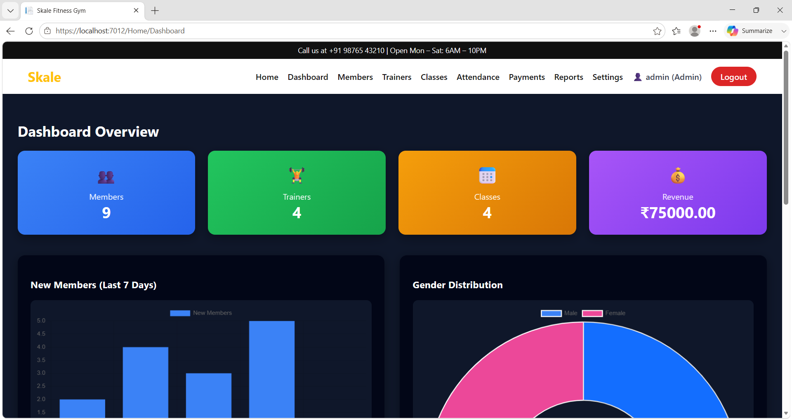
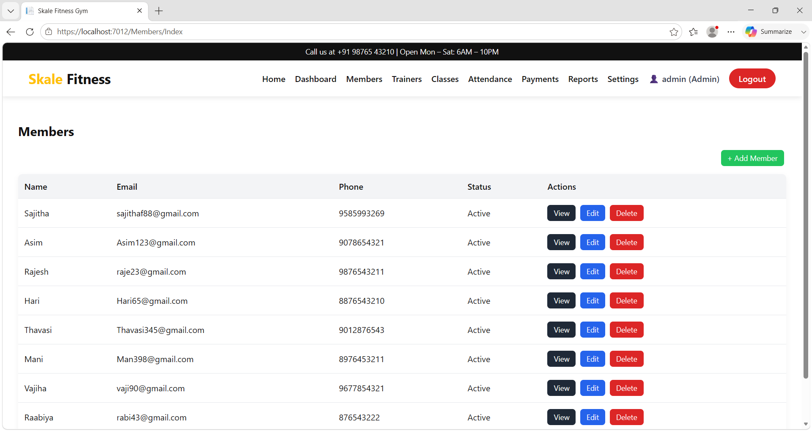
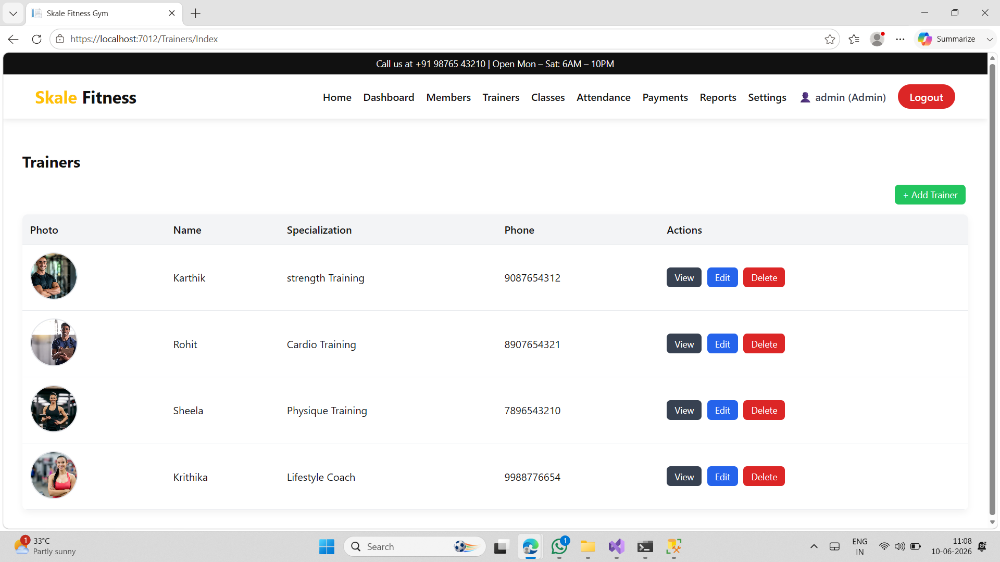
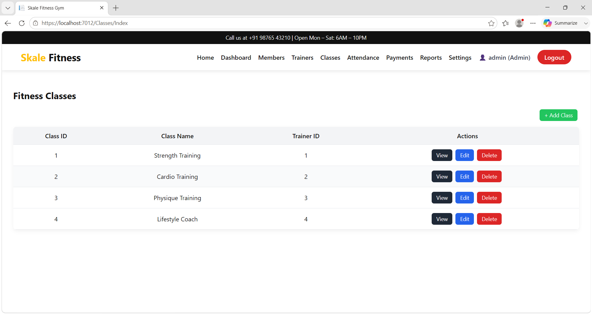
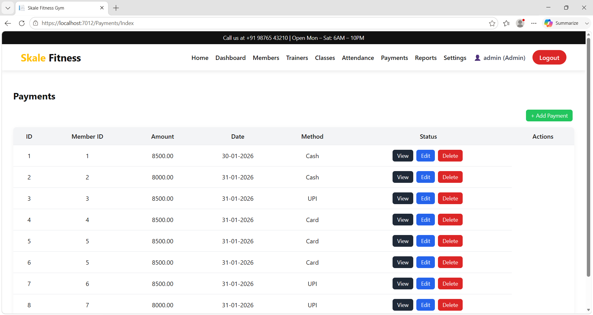
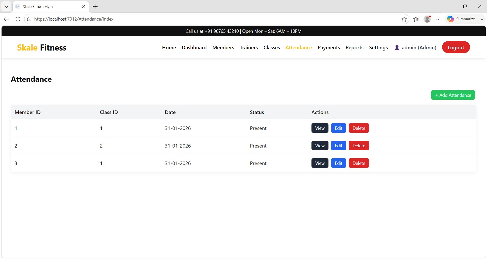
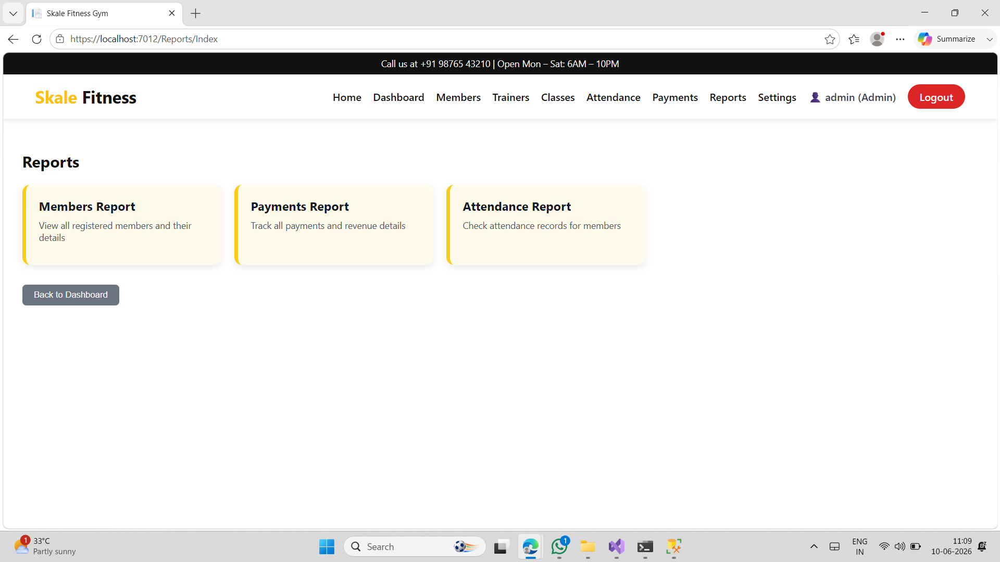

# Skale Fitness Management System

## Project Description

Skale Fitness Management System is a web-based gym management application developed to manage gym members, trainers, memberships, workout plans, attendance, and billing efficiently.

## Features

* Member Management
* Trainer Management
* Classes Scheduling
* Attendance Tracking
* Payments
* Fitness Reports

## Technologies Used

* ASP.NET MVC
* C#
* SQL Server
* HTML
* CSS
* JavaScript

## Screenshots

### Home Page

### Dashboard

### Members Module

### Trainers Module

### Classes Module

### Payments Module

### Attendance Module

### Reports

## Developed By

Sajitha Fathima
